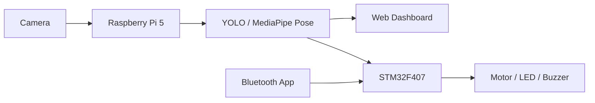

# 🤖 실시간 행동 분석 기반 AI 안전관리 로봇

> 실시간 행동 분석 기반 대응 로봇은 Raspberry Pi 5, STM32F407, YOLO, MediaPipe Pose, Hailo AI Accelerator, Web Dashboard를 연동하여 위험 행동을 실시간으로 탐지하고 하드웨어 반응까지 수행하는 통합 로봇 시스템입니다.

> 현재 `assets/`에는 README에서 안전하게 참조할 수 있는 로컬 이미지/GIF 파일이 없습니다. 로컬 데모 이미지는 파일이 실제로 추가된 뒤 연결하고, 통합 동작 영상은 아래 YouTube 썸네일 링크로 제공합니다.

---

## 🎬 Demo

### Integrated Operation Demo

> Click the thumbnail to watch the full integrated operation demo on YouTube.

### Local Demo Assets

| Asset | Status |
|---|---|
| AI Detection Demo GIF | `assets/detection_demo.gif` 파일이 추가되면 README에 연결 |
| Web Monitoring Dashboard | `assets/web_dashboard.png` 파일이 추가되면 README에 연결 |
| Project Cover Image | `assets/cover_robot.png` 파일이 추가되면 제목 아래 대표 이미지로 연결 |

---

## ✨ Key Features

| Feature | Description |
|---|---|
| 실시간 위험 행동 탐지 | `person`, `falldown`, `attack`, `smoking` 클래스를 실시간 영상에서 감지 |
| Edge AI 추론 | Raspberry Pi 5와 Hailo AI Accelerator 기반으로 현장 처리 성능 확보 |
| Pose 기반 보조 판단 | MediaPipe Pose를 활용해 사람 자세 정보를 보조적으로 분석 |
| Web Dashboard | 실시간 영상, FPS, 위험 알림, 클래스별 상태·통계를 한 화면에서 확인 |
| STM32 하드웨어 반응 | LED, Buzzer, Motor Driver 등 물리 출력 장치를 위험 상황과 연동 |
| Bluetooth 수동 제어 | HC-06 + STM32 UART 기반 전진/후진/회전/정지/속도 제어 지원 |

---

## 🧰 Tech Stack

| Category | Stack |
|---|---|
| AI / Vision | YOLO, MediaPipe Pose, OpenCV, ByteTrack, Hailo AI Accelerator |
| Edge / Embedded | Raspberry Pi 5, STM32F407, GPIO, UART, PWM, HC-06 Bluetooth |
| Web | HTML, CSS, JavaScript |
| Structure | `src/`, `sever/`, `stm32/`, `utils/`, `docs/`, `assets/` |

---

## 🏗 System Flow

전체 시스템은 카메라 입력, AI 탐지, 웹 모니터링, STM32 제어, 하드웨어 반응으로 이어집니다. 로컬 `operation_flow` 이미지가 아직 없으므로, 현재는 깨지지 않는 Mermaid 다이어그램으로 흐름을 표시합니다.

---

## 🔌 Hardware Configuration

Raspberry Pi 5는 영상 처리와 AI 추론을 담당하고, STM32F407은 모터·LED·Buzzer 등 물리 장치 제어를 담당합니다. 하드웨어 회로 이미지는 `assets/hardware_circuit.png` 같은 실제 파일이 추가된 뒤 연결할 수 있습니다.

---

## 🗂 Dataset

- 데이터 출처: AI Hub 데이터 + 직접 수집 데이터
- 규모: 약 4만 장
- 감지 클래스: `person`, `falldown`, `attack`, `smoking`
- 작업 내용: 라벨 생성, 누락 라벨 확인, 오분류 라벨 수정, 학습 구조 정리

데이터셋 분포 또는 라벨링 결과 이미지는 실제 파일이 `assets/`에 추가된 뒤 README에 연결합니다.

---

## 📈 AI Model Training

YOLO 기반 커스텀 객체 탐지 모델을 학습하고 Precision, Recall, mAP 지표를 기준으로 성능을 분석했습니다. `attack`과 `smoking`처럼 자세와 손 위치가 유사한 클래스는 오탐 사례를 검토한 뒤 데이터 정제와 재학습을 반복했습니다.

| Metric | Result |
|---|---:|
| mAP@50 | **0.977** |
| mAP@50:95 | **0.898** |
| FPS | **43.9** |
| Latency | **18.8 ms** |

---

## 🚀 Model Optimization

모델 최적화는 실시간 동작을 목표로 추론 지연시간과 처리량을 함께 확인하는 방식으로 진행했습니다. Hailo AI Accelerator 적용 후 Raspberry Pi 환경에서도 웹 모니터링과 하드웨어 제어를 함께 수행할 수 있도록 성능을 개선했습니다.

---

## 📊 Performance Analysis

| Item | Summary |
|---|---|
| Throughput | 실시간 영상 처리와 위험 행동 감지를 위한 FPS 확인 |
| Latency | 위험 행동 감지 후 하드웨어 반응까지의 지연시간 최소화 |
| Stability | Web Dashboard, STM32 UART, Bluetooth 제어 경로를 분리해 동작 안정성 확보 |

성능 비교 그래프는 실제 `assets/processing_performance.png`, `assets/latency_comparison.png` 등이 추가되면 연결합니다.

---

## 🏁 Final Result

| mAP@50 | mAP@50:95 | FPS | Latency |
|---:|---:|---:|---:|
| **0.977** | **0.898** | **43.9** | **18.8 ms** |

최종적으로 AI 탐지, 웹 대시보드, STM32 제어, Bluetooth 수동 제어를 하나의 시스템으로 통합했습니다.

---

## 📚 Detailed Documentation

> 프로젝트의 역할 분담, 시스템 구조, 문제 해결 과정, 학습 결과는 아래 문서에서 자세히 확인할 수 있습니다.

| Document | Description | Link |
|---|---|---|
| 🙋 담당 역할 상세 | 데이터셋 구축, AI 학습, 웹 대시보드, Bluetooth/STM32 연동 등 담당 구현 범위 정리 | [문서 보기](docs/contribution.md) |
| 📘 기술 보고서 | 전체 시스템 아키텍처, 동작 흐름, 하드웨어/소프트웨어 연동 구조 정리 | [문서 보기](docs/technical_report.md) |
| 🚧 트러블슈팅 | 구현 중 발생한 문제, 원인 분석, 해결 과정, 최종 결과 정리 | [문서 보기](docs/troubleshooting.md) |
| 📈 학습 결과 | 데이터셋 구성, YOLO 학습 결과, mAP, latency, 클래스별 성능 정리 | [문서 보기](docs/training_result.md) |

---

## 📁 Repository Structure

| Path | Description |
|---|---|
| `src/` | 실시간 비전 처리 및 worker 코드 |
| `sever/` | 웹 대시보드 템플릿과 서버 관련 파일 |
| `stm32/` | STM32 제어 코드 |
| `utils/` | 공통 유틸리티와 Raspberry Pi 연동 로직 |
| `docs/` | 상세 문서, 학습 결과, 트러블슈팅, 기여 범위 정리 |
| `assets/` | README와 문서에 사용할 이미지/GIF/미디어 안내 |

---

## ▶️ Usage

1. Raspberry Pi 5와 카메라, Hailo AI Accelerator를 연결합니다.
2. STM32F407, HC-06 Bluetooth, Motor Driver, LED, Buzzer를 연결합니다.
3. 환경에 맞게 모델 경로와 카메라 입력 설정을 구성합니다.
4. 웹 대시보드와 worker 프로세스를 실행해 실시간 탐지 상태를 확인합니다.

> 실행 환경과 하드웨어 연결 방식은 시스템 구성에 따라 달라질 수 있으므로, 상세 구현 흐름은 [기술 보고서](docs/technical_report.md)를 참고하세요.

---

## 🙋 Team / Role

| Area | What I did |
|---|---|
| **Dataset** | AI Hub + 직접 수집 데이터 정리, 4개 클래스 라벨링·검수 |
| **AI Training** | YOLO 커스텀 학습, Precision/Recall/mAP 분석, 혼동 클래스 재학습 |
| **Web Dashboard** | 실시간 영상, FPS, 위험 알림, 클래스별 상태·통계 UI 구현 |
| **Bluetooth Control** | HC-06 + STM32 UART 기반 전진/후진/회전/정지/속도 제어 연동 |

> 팀 전체 구현 영역인 STM32 전체 제어, Hailo 변환, 하드웨어 제작은 별도 시스템 구성으로 구분했습니다.

---

## 📝 Notes

- README의 로컬 이미지 링크는 실제 파일이 `assets/`에 존재할 때만 추가합니다.
- GitHub README에서는 YouTube 영상을 `iframe`이 아닌 Markdown 썸네일 링크 방식으로 연결합니다.
- 저장소의 폴더명은 현재 구조에 맞춰 `sever/`를 유지합니다.
