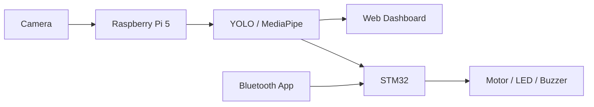

# 🤖 실시간 행동 분석 기반 AI 안전관리 로봇

## 📌 프로젝트 핵심

> 실시간 영상에서 **낙상·흡연·공격 행동**을 감지하고, **웹 모니터링 UI**와 **Bluetooth 로봇 제어**에 연동한 AI 안전관리 로봇입니다.

**My Role**: Dataset 전처리 · YOLO 학습 · Web Dashboard · Bluetooth 제어 연동  
**Key Result**: 약 4만 장 커스텀 데이터셋 / **mAP@50 0.977** / **43.9 FPS**

**Demo media will be added.**

---

## 📊 Results

| mAP@50 | mAP@50:95 | FPS | Latency |
|---:|---:|---:|---:|
| **0.977** | **0.898** | **43.9** | **18.8 ms** |

---

## 🎥 Demo

| 🎥 AI Detection | 🖥 Web Dashboard | 📡 Bluetooth Control |
|---|---|---|
| `assets/detection_demo.gif` 추가 예정 | `assets/web_dashboard.png` 추가 예정 | `assets/bluetooth_control.jpg` 추가 예정 |
| 사람·낙상·공격·흡연 감지 | 실시간 영상·FPS·알림·통계 | HC-06 + STM32 UART 수동 제어 |

---

## 🙋 My Contribution

| Area | What I did |
|---|---|
| **Dataset** | AI Hub + 직접 수집 데이터 정리, 4개 클래스 라벨링·검수 |
| **AI Training** | YOLO 커스텀 학습, Precision/Recall/mAP 분석, 혼동 클래스 재학습 |
| **Web Dashboard** | 실시간 영상, FPS, 위험 알림, 클래스별 상태·통계 UI 구현 |
| **Bluetooth Control** | HC-06 + STM32 UART 기반 전진/후진/회전/정지/속도 제어 연동 |

> 팀 전체 구현 영역인 STM32 전체 제어, Hailo 변환, 하드웨어 제작은 별도 시스템 구성으로 구분했습니다.

---

## 📌 프로젝트 개요

CCTV 관제의 사각지대와 대응 지연을 줄이기 위한 **실시간 행동 분석 기반 AI 안전관리 로봇**입니다.  
감지 클래스는 `person`, `falldown`, `attack`, `smoking`입니다.

---

## 🏗 시스템 구조

---

## 🧰 Tech Stack & Details

| Category | Stack |
|---|---|
| AI / Vision | YOLO, MediaPipe Pose, OpenCV, ByteTrack, Hailo AI Accelerator |
| Edge / Embedded | Raspberry Pi 5, STM32F407, GPIO, UART, PWM, HC-06 Bluetooth |
| Web | HTML, CSS, JavaScript |
| Structure | `src/`, `sever/`, `stm32/`, `utils/`, `docs/`, `assets/` |

자세한 내용은 문서로 분리했습니다.

- [담당 역할 상세](docs/contribution.md)
- [기술 보고서](docs/technical_report.md)
- [트러블슈팅](docs/troubleshooting.md)
- [학습 결과](docs/training_result.md)
